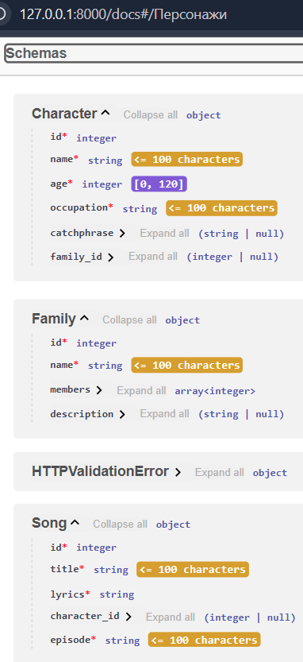
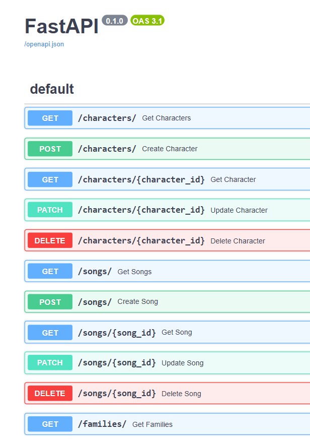
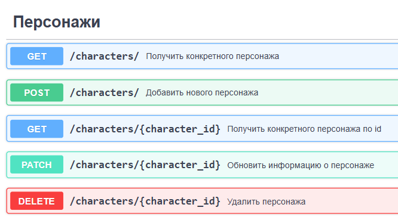
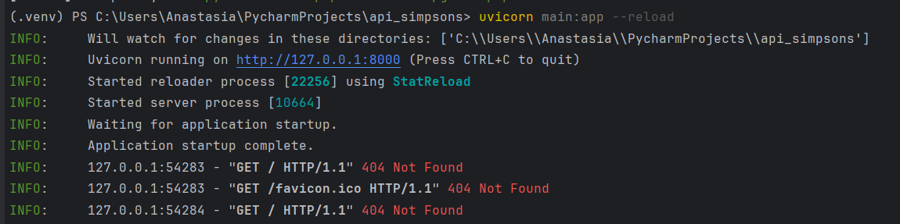
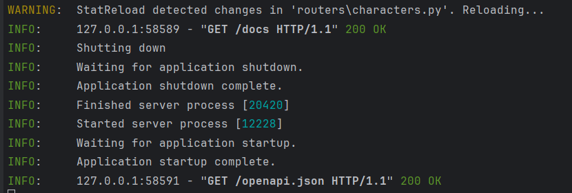
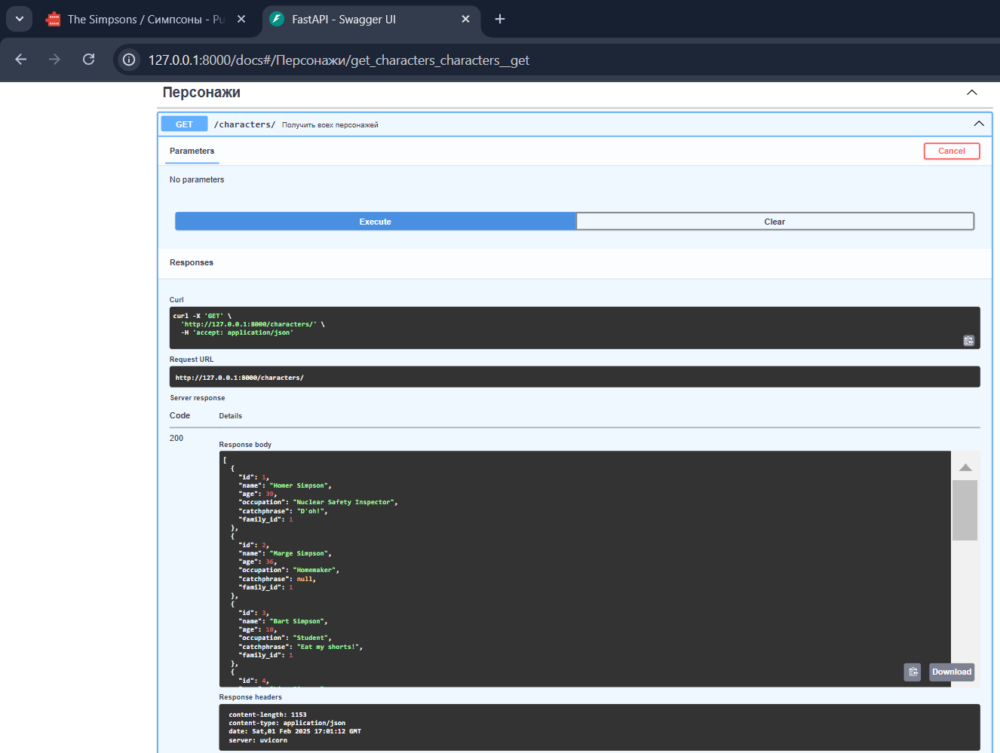
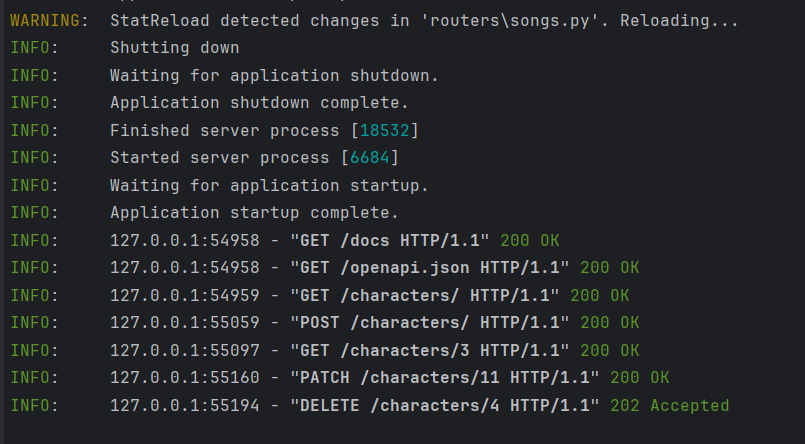

# Реализация RESTful API для мультсериала "Симпсоны"

Для реализации RESTful API для мультсериала "Симпсоны" мы будем использовать фреймворк **FastAPI**. FastAPI
автоматически валидирует данные с помощью **Pydantic**. Например, если поле `age` в модели выходит за пределы допустимых
значений (0–120), FastAPI вернет ошибку `422` с описанием проблемы.

Будем использовать три модели: Character (Персонаж), Song (Песня) и Family (Семья)

---

## Шаги реализации

1. **Создание проекта и настройка окружения**
2. **Создание моделей данных**
3. **Реализация CRUD операций для каждой модели**
4. **Написание тестов**

---

## 1. Настройка окружения

Установка FastAPI:
```bash
pip install fastapi
```

Файл main.py
основной файл приложения, который запускает FastAPI
app = FastAPI() — создает экземпляр приложения FastAPI.

Файл models.py содержит модели данных, которые используются для валидации и сериализации данных API
Каждая из наших трех моделей Character , Song и Family будет наслодоваться от BaseModel
Дял этого импортируем Импорт Pydantic
из этой же библиотеки будем использовать Field чтобы задать доп. граничений на поля (по типу максимальная длина строки)

## 2 Описание моделей(объектов)

Модель Character:
id — уникальный идентификатор
name — имя персонажа (максимум 100 символов)
age — возраст (от 0 до 120)
occupation — род занятий (максимум 100 символов)
catchphrase — коронная фраза (необязательное поле)
family_id — ID семьи, к которой принадлежит персонаж (необязательное(Optional) поле)
Модель Family:
id — уникальный ид
name — название семьи (мак.100 символов)
members — список ID персонажей, входящих в семью
description — описание семьи (Optional, максимум 200 символов)
Модель Song:
id — уникальный ид
title — название песни (макс. 100 символов)
lyrics — текст песни
character_id — ID персонажа, который исполнил песню (Optional поле)
episode — название эпизода, в котором звучала песня (максимум 100 символов)

Посмотрим на заданные модели и ограничения на их поля:


-------------

Так как перед нами задача создать RESTfull API, то он должен поддерживает все CRUD операции т.е. GET/POST/PATCH/DELETE
Тут нам понадобятся знания о http status codes, которые выдаются сервером в ответ на запрос клиента
https://en.wikipedia.org/wiki/List_of_HTTP_status_codes
Мы будем работать только с некоторыми из них, такими как:
200 - ОК
201 - created
202 - Accepted
204 - no contect
400 - bad request
404 - notfound
500 - Internal Server Error

Для более структурированнного кода и дальнейшей отладки будем сполььзовать рутеры для каждой из моделей
https://fastapi.tiangolo.com/reference/apirouter/#fastapi.APIRouter.get--example - по роутеры можно прояитать тут

На примере routers/characters.py рассотрим создание эндпоинтов/ручек для crud-операций:
Импортируем APIRouter, исключения и модель Персонажа:
from fastapi import APIRouter, HTTPException
from models import Character
создаем экземпляр роутера:
router = APIRouter()
Эндпоинты:
GET /api/characters - список всех персонажей, необходимо возвратить ответ с кодом 200 (OK) и вложить JSON с полями
объекта.

```
@router.get("/characters/", response_model=list[Character])
def get_characters():
    return characters_db
```

GET /api/characters/{character_id} - информация о персонаже с указанным id, необходимо возвратить ответ с кодом 200 (OK)
и вложить JSON с полями объекта.

```
@router.get("/characters/{character_id}", response_model=Character)
def get_character(character_id: int):
    character = next((c for c in characters_db if c.id == character_id), None)
    if character is None:
        raise HTTPException(status_code=404, detail="Character not found")
    return character
```

POST /api/characters - добавление нового персонажа. В теле входящего запроса необходимо ожидать JSON структуры объекта.

```
@router.post("/characters/", response_model=Character)
def create_character(character: Character):
    characters_db.append(character)
    return character
```

PATCH /api/characters/{character_id} - изменение информации о персонаже с указанным id. Входящий запрос и формат ответов
при удачном и неудачном изменении совпадают с предыдущим методом, в случае, если запись с указанным id не найдена,
необходимо возвратить ответ с кодом 404 (Not Found).

```
@router.patch("/characters/{character_id}", response_model=Character)
def update_character(character_id: int, updated_character: Character):
    character = next((c for c in characters_db if c.id == character_id), None)
    if character is None:
        raise HTTPException(status_code=404, detail="Character not found")
    character.name = updated_character.name
    character.age = updated_character.age
    character.occupation = updated_character.occupation
    character.catchphrase = updated_character.catchphrase
    character.family_id = updated_character.family_id
    return character
```

DELETE /api/characters/{character_id} - удаление записи о персонаже с указанным id:
В случае успеха необходимо возвратить ответ с кодом 202 (Accepted).
В случае, если запись с указанным id не найдена, необходимо возвратить ответ с кодом 404 (Not Found).
В случае других ошибок необходимо возвратить ответ с кодом 500 (Internal Server Error) и вложить JSON следующей
структуры:
json
{
"status": 500,
"reason": "<Причина неудачи>"}

```
@router.delete("/characters/{character_id}", tags=["Персонажи"], status_code=status.HTTP_202_ACCEPTED,
               summary="Удалить персонажа")
def delete_character(character_id: int):
    # Поиск персонажа по ID
    character_index = next((index for index, c in enumerate(characters_db) if c.id == character_id), None)

    # Если персонаж не найден
    if character_index is None:
        raise HTTPException(
            status_code=status.HTTP_404_NOT_FOUND,
            detail="Character not found"
        )

    # Удаление персонажа
    del characters_db[character_index]

    # Возвращаем успешный ответ
    return {"message": "Character deleted"}
```

# Подклюим роутеры в main.py

app.include_router(characters.router)
app.include_router(songs.router)
app.include_router(families.router

Сейчас приложение работает
Откроем браузер и перейдем по адресу: http://127.0.0.1:8000/docs, где видим документацию вашего API автоматически
сгенерированную Swagger UI
Документация не выгдляит красиво и понятно(Всё перемешанно между собой и нет конкретных описаний)


Для ее структурирования будем использовать атрибут tags для добавления заголовков

Пример:
@router.delete("/songs/{song_id}", tags=["Песни 🎶"])
И атрибут summary для добавления описаний

Пример:  @router.delete("/characters/{character_id}", ..., summary="Удалить персонажа")

Заполним временны хранилища данными о вселенной Симпсонов:
characters_db = [...]
songs_db = [...]
families_db = [...]

## 4 Тесты


## Запуск
 pip install fastapi uvicorn
 uvicorn main:app --reload

В дальнейшем при изменении кода будет перезапускаться автоматически

Прямо на сайте можно все "потыкать"


Проверка для модуля персонажей:
